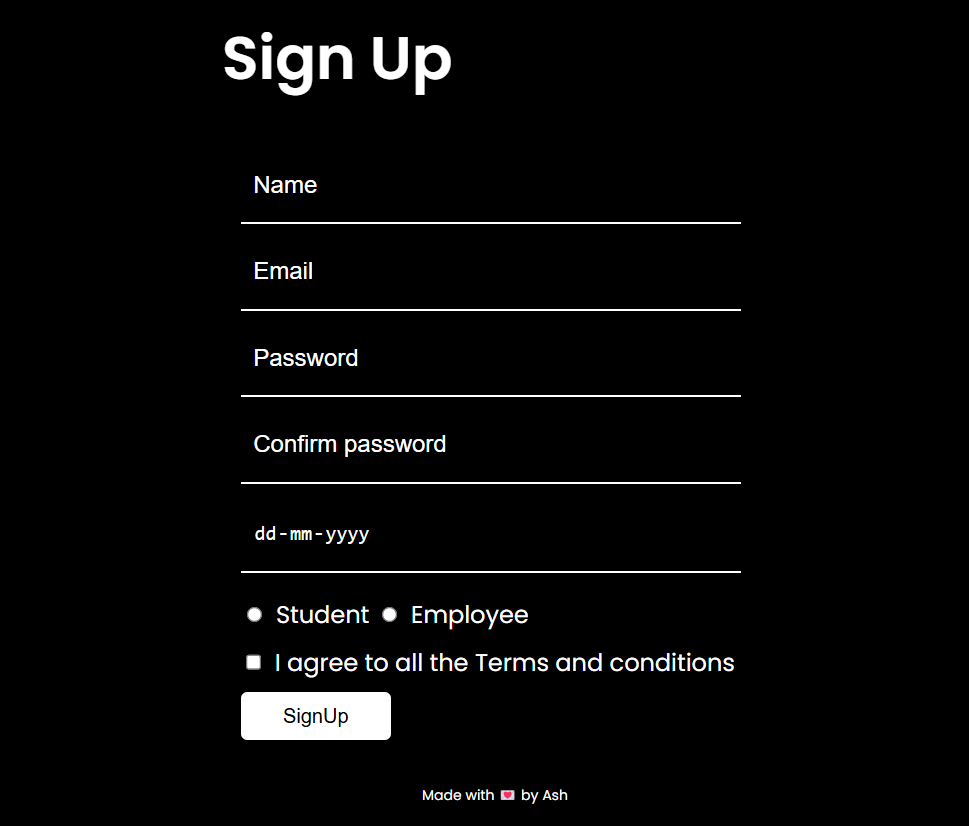

# Signup Form

This project contains a simple signup form built using HTML, CSS, and JavaScript. It is designed to be minimalist and clean with a dark theme. The form is fully responsive and user-friendly.

## Features

- Stylish and modern design
- Responsive layout
- Simple, clean form with various input fields
- Placeholder text for inputs
- Easy-to-customize styles

## Installation

1. Clone the repository:
   ```bash
   git clone https://github.com/ashpatni20/SignUp-Form.git


## Screenshot

